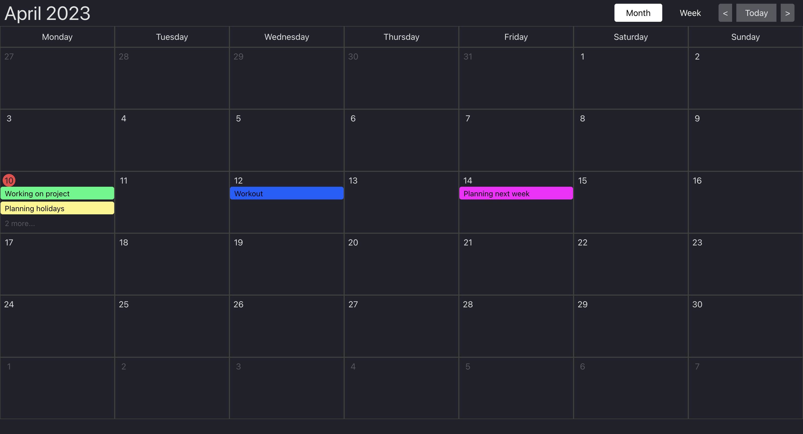

# Calendar App

Calendar with month and week views using Typescript and React




### For this project I have used these technologies:

- [React](https://reactjs.org/)
- [TypeScript](https://www.typescriptlang.org/)
- React-redux / Redux-toolkit
- vite
- [Tailwind](https://tailwindui.com/)


## How to start

#### Intall [Node.js](https://nodejs.org/en/)

#### Clone project

#### In root directory run

```
npm install
```

#### Run project

```
npm run dev
```
- Open localhost server in terminal

## How to build

```
npm run build
```
## Available Scripts

In the project directory, you can run:

### `npm run dev`
### `npm run build`